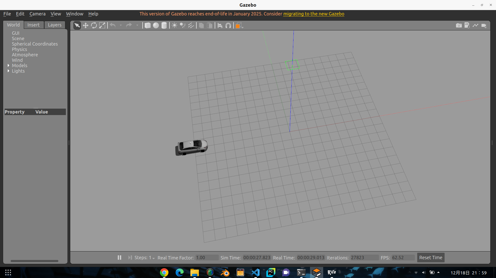
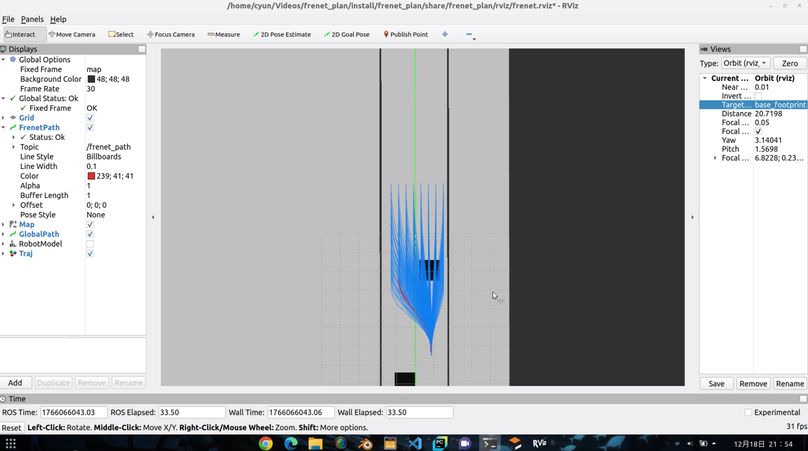
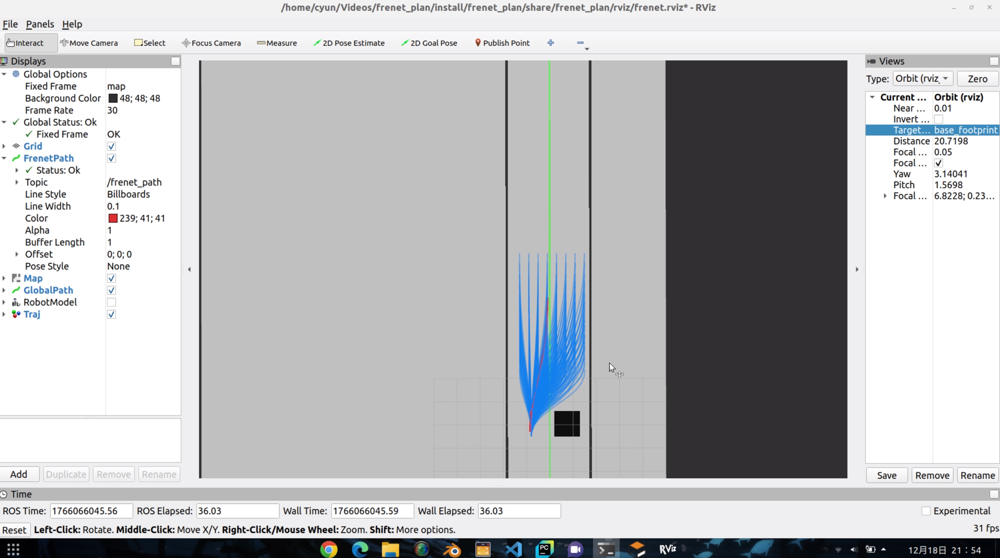

https://github.com/user-attachments/assets/4ab4722c-9f90-4c94-9f36-1c37df5440e8


# frenet_plan
基于frenet坐标系的规划+环境env-ros2实现

# 启动仿真环境.
ros2 launch niagara_model display.launch.py

# 启动算法
ros2 launch frenet_plan frenet_planner.launch.py

# 测试数据
ros2 run frenet_plan test_publisher.py 

# 运行控制
ros2 run frenet_plan  test_control.py

# Frenet Planner

基于Frenet坐标系的采样规划器，用于ROS2。

## 功能特性

- 使用五次多项式进行横向规划
- 使用四次多项式进行纵向规划  
- 生成多条候选轨迹并选择最优轨迹
- 支持动态障碍物避让
- 实时轨迹可视化

## 订阅话题

- `/local_path_plan` (nav_msgs/Path): 参考线轨迹
- `/local_vel_cmd` (std_msgs/Float64MultiArray): 参考速度
- `/odom` (nav_msgs/Odometry): 当前位置和速度
- `/costmap` (nav_msgs/OccupancyGrid): 代价地图用于避障

## 发布话题

- `/frenet_path` (nav_msgs/Path): 最优轨迹
- `/frenet_vel` (std_msgs/Float64MultiArray): 最优轨迹速度
- `/frenet_trajectories` (visualization_msgs/MarkerArray): 所有候选轨迹可视化

## 构建

```bash
cd ~/plan_ws_last
colcon build --packages-select frenet_plan
source install/setup.bash
```

## 运行

```bash
ros2 launch frenet_plan frenet_planner.launch.py
```

或直接运行节点：

```bash
ros2 run frenet_plan frenet_plan_node
```

## 参数配置

参数在 `config/frenet_params.yaml` 中配置：

- `max_speed`: 最大速度 (m/s)
- `max_accel`: 最大加速度 (m/s²)
- `max_curvature`: 最大曲率 (1/m)
- `max_road_width_left/right`: 道路宽度 (m)
- `d_road_sample`: 横向采样间隔 (m)
- `target_speed`: 目标速度 (m/s)
- `robot_radius`: 机器人半径，用于碰撞检测 (m)
- `costmap_obstacle_threshold`: Costmap障碍物阈值 (0-100)
- 代价权重: `k_jerk`, `k_time`, `k_lat`, `k_lon`

## 可视化

在RViz中添加以下显示：
- Path: `/frenet_path` - 最优轨迹
- MarkerArray: `/frenet_trajectories` - 所有候选轨迹
